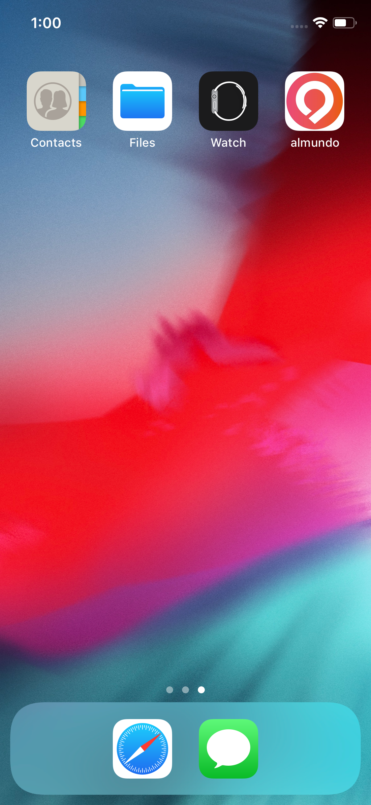
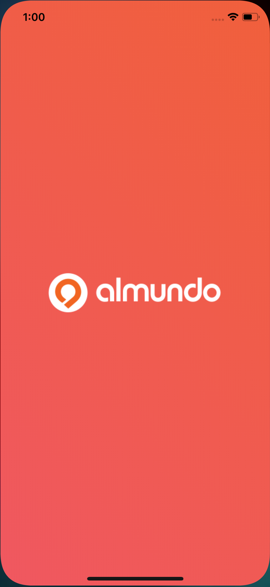
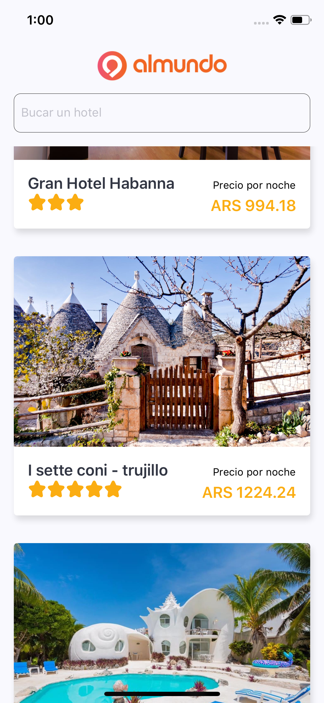
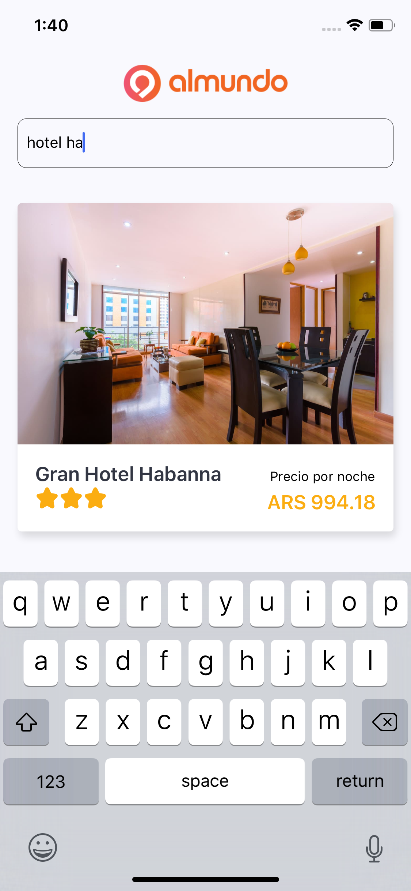
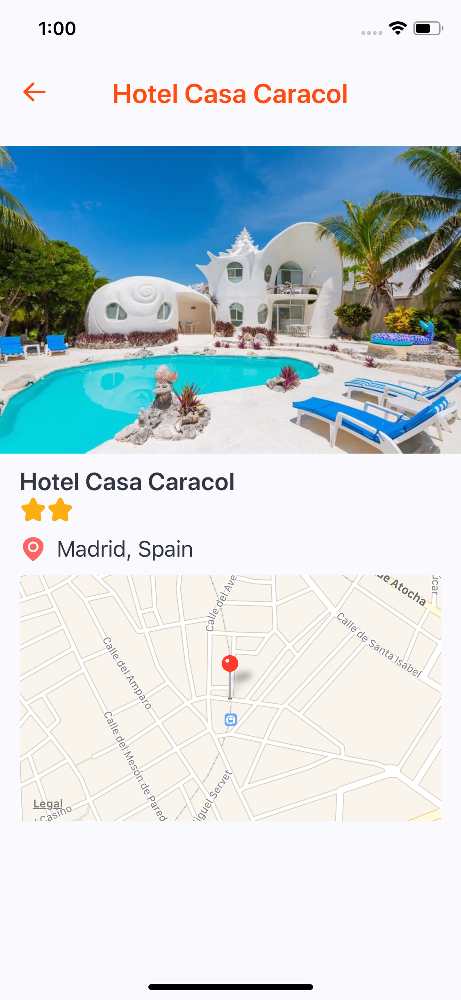

# almundo

# Overview

This repo contains a lite version of almundo application, you can find a list of available hotels, also there is a search input where you can look for a hotel, each card in the list is touchable, after touching a hotel card the app will navigate to the details screen where hotel location is shown inside a map and an image carousel with all photos for that specific hotel.

## Developer notes:

The following packages and api's that were used to build the app:

- this project has been built using typescript.
- React hooks where implemented.
- `react-native-fast-image`, this package allows render images faster.
- `react-navigation`, implemented to be able to navigate.
- `react-native-vector-icons`, all icons rendered are taken from this package.
- `react-native-splash-screen`, splash screen implemented using this package.

## Before we start

Please make sure you have `node`, `npm`, `git`, `cocoapods` installed correctly. In case you don't have any of those installed and setup, please go to [nodejs.org](https://nodejs.org/en/) to download and install the **Recommended For Most Users** version, or go [here](https://git-scm.com/downloads); to download `git`. `cocoapods` can be set up following this [link](https://facebook.github.io/react-native/docs/integration-with-existing-apps).

## Setup

### React Native

Please refer the [React Native docs Getting Started guide](https://facebook.github.io/react-native/docs/getting-started) over the **React Native CLI Quickstart** tab. There, you can see all the detailed setup processs for `Android` and `iOS` platforms.

### This Project

Once the above parts are setup, you can go ahead and clone the repo using the following command in your terminal:

```
git clone https://github.com/jevvilla/almundo.git
```

Then go to the project root (project folder), and run the following commands to get the app running:

- `git checkout dev` to be placed in the correct branch.
- `yarn` or `npm i` - Install project dependencies.
- NOTE: don't forget install Pods, from the root path run `cd ios && pod install`.
- `npx react-native run-ios` - Run the app locally. By default this will run an iPhone X simulator.
- `npx react-native run-android` - install to the single Android device connected (if more than one are connected, you must specify the device with `—deviceId` which can be gotten from `adb devices`).

Once `npx react-native run-ios` or `npx react-native run-android` finish up, you should be able to see app running.

## Screenshots

### App


#### App Icon



#### Splash Screen



#### Home



#### Search



#### Details


